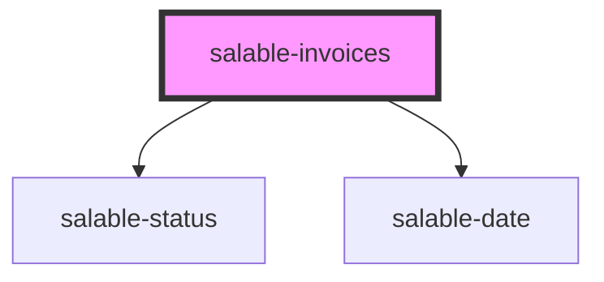

## Properties

| Property           | Attribute           | Description                                                             | Typing  | Default     |
| ------------------ | ------------------- | ----------------------------------------------------------------------- | ---------- | ----------- |
| `apiKey`           | `api-key`           | The publishable api key, this can be generated in the Salable dashboard | `string` | `undefined` |
| `limit`            | `limit`             | The number of rows to display per page                                  | `number` | `25`        |
| `subscriptionUuid` | `subscription-uuid` | The uuid of the subscription that you want to display invoices for.     | `string` | `undefined` |

## Dependencies

### Depends on

- [salable-status](../common/salable-status)
- [salable-date](../common/salable-date)

### Graph

----------------------------------------------

## Further reading

- Read [about reference](https://diataxis.fr/reference/) in the Diátaxis framework
