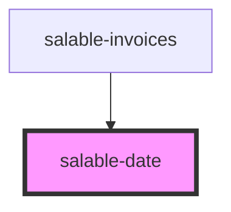

# salable-date

<!-- Auto Generated Below -->

## Properties

| Property | Attribute | Description | Type               | Default     |
| -------- | --------- | ----------- | ------------------ | ----------- |
| `date`   | `date`    |             | `number \| string` | `undefined` |

## Dependencies

### Used by

 - [salable-invoices](../../salable-invoices)

### Graph

----------------------------------------------

*Built with [StencilJS](https://stenciljs.com/)*
