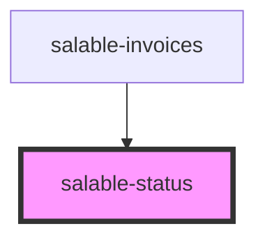

# salable-status

<!-- Auto Generated Below -->

## Properties

| Property     | Attribute     | Description | Type                                                           | Default              |
|--------------|---------------|-------------|----------------------------------------------------------------|----------------------|
| `statusType` | `status-type` |             | `StatusType.ERROR \| StatusType.SUCCESS \| StatusType.WARNING` | `StatusType.SUCCESS` |

## Dependencies

### Used by

- [salable-invoices](../../salable-invoices)

### Graph

----------------------------------------------

*Built with [StencilJS](https://stenciljs.com/)*
