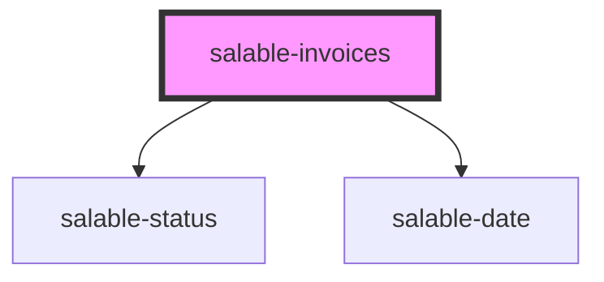

# salable-invoices

<!-- Auto Generated Below -->

## Properties

| Property           | Attribute           | Description | Type     | Default     |
| ------------------ | ------------------- | ----------- | -------- | ----------- |
| `apiKey`           | `api-key`           |             | `string` | `undefined` |
| `limit`            | `limit`             |             | `number` | `25`        |
| `subscriptionUuid` | `subscription-uuid` |             | `string` | `undefined` |

## Dependencies

### Depends on

- [salable-status](../common/salable-status)
- [salable-date](../common/salable-date)

### Graph

----------------------------------------------

*Built with [StencilJS](https://stenciljs.com/)*
