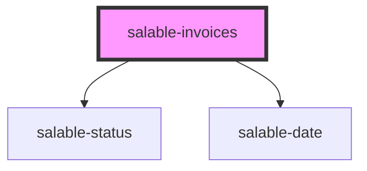

# salable-invoices

<!-- Auto Generated Below -->

## Properties

| Property                        | Attribute           | Description                                                         | Type     | Default     |
| ------------------------------- | ------------------- | ------------------------------------------------------------------- | -------- | ----------- |
| `limit`                         | `limit`             | The number of rows to display per page                              | `number` | `25`        |
| `sessionToken` _(required)_     | `session-token`     | The generated token for this session                                | `string` | `undefined` |
| `subscriptionUuid` _(required)_ | `subscription-uuid` | The uuid of the subscription that you want to display invoices for. | `string` | `undefined` |

## Dependencies

### Depends on

- [salable-status](../common/salable-status)
- [salable-date](../common/salable-date)

### Graph

----------------------------------------------

*Built with [StencilJS](https://stenciljs.com/)*
